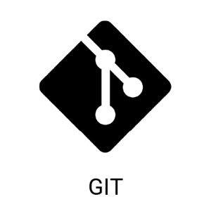

# Работа с Git
## 1. Проверка наличия установленного Git
В терминале выполнить команду : `git version`
Если Git установлен, появится сообщение о версии программы. Иначе будет сообщение об ошибке.

## 2. Установка Git
Загружаем последнюю версию **Git** с сайта https://git-scm.com/downloads
Устанавливаем с настройками по умолчанию.

## 3. Настройка Git
При первом использовании **Git** необходимо представиться. Для этого нужно ввести в терминале две команды: 
```
git config --global user.name "Ваше имя"
git config --global user.emile ваша "почта@example.com"
```
# 4. Инициализация репозитория.
В терминале переходим к папке в которой хотим создать репозиторий. Выполняем команду: `git init`
В исходной папке появится скрытая папка *.git*

# 5. Запись изменений в репозитарий.

Каждый файл в рабочей папке (репозитарии) может находится в одном из двух состояний: под версионным конторолем (отслеживаемые -tracked) и нет (неотслеживаемые - untracked)
*
Отслеживаемы файлы могут быть неизмененными, измененными или подготовленными к коммиту.
Чтобы посмотреть состояние файлов в репозитарии необходимо выполнить команду:
```
git status
```
Для того чтобы начать отслеживать новый файл, используется команда:
```
git add <имя файла с расшиирением>
```
Это многофункциональная команда, она используется для добавления под версионный контроль новых файлов, для индексации изменений (подготовке к записи изменений).
Чтобы зафиксировать изменения используется команда:
```
git commit -m "<Текст коммита - описание сделанных в файле изменений>"
```
* To see the difference between the current file and the current commit, you can run the command:
```
git diff
```
## 6. Просмотр истории коммитов
Для просмотра истории коммитов используется команда 
```
git log
```
This command lists commits with their hash codes, the name and email of the author, the date of creation and the message of the commit.
By default, the latest commits are at the top.

Для выхода из режима просмотра истории используется клавиша q

## 7. Перемещения между сохранениями (коммитами)
Для перемещения между коммитами используется команда:
```
git checkout <хэш-код>
```
Хэш-код присваевается каждому коммиту. Для удобства, в команде достаточно указать первые 4 символа хэш-кода.

## 8. Игнорирование файлов
Для того, чтобы исключить из отслеживания в репозитории определенные файлы или папки необходимо создать там файл 
***.gitignore*** и записать в него их названия или шаблоны соответствующие таким файлам или папкам.

## 9. Создание веток в Git
Ветка в Git - это простой перемещаемый указатель на один из коммитов, обычно последний в цепочке коммитов. По умолчанию имя основоной ветки в Git - master.

## 10. Слияние веток и разрешение конфликтов
Для слияния выбранной ветки с текущей нажно выполнить команду:
```
git merge <назавние выбранной ветки>
```
Если была изменена одна и та же чать файла в обеих ветках, то может возникнуть конфликт, который потребует участие пользователя. Git предлагает варианты разрешения.
Чтобы разрешить конфликт, нужно выбрать один из вариантов, либо объединить содержимое по-своему.
После разрешения конфликта нужно выполнить коммит слияния, например:
```
git commit -a -m "Merge branch, выбранная ветка"
```
```
git merge <название выбранной ветки>
```

## 11. Удаление веток
После выполнения слияния ненужную ветку можно удалить командой:
```
git branch -d <название ветки>
```
Если возникла ошибка о неполном слиянии ветки с основной веткой:
(The branch is not fully merged), программа предлагает выполнить 
команду:
```
git branch -D <название ветки>
```
предупреждая нас о том, что теперь ветка будет удалена.
